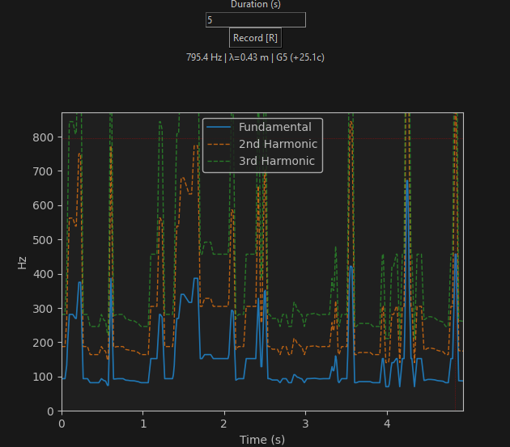
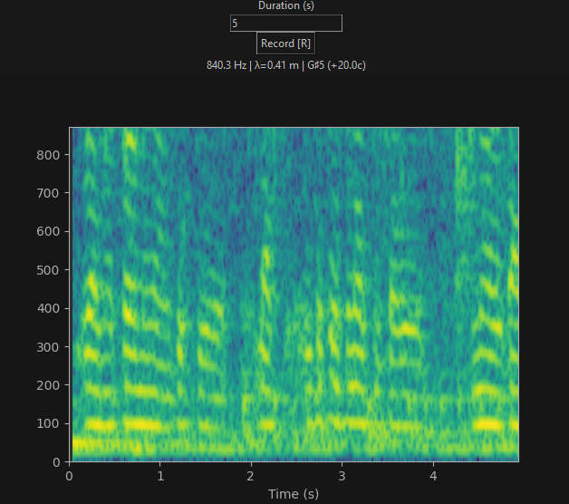

# Frequency Visualizer

[](https://www.python.org/)
[](LICENSE)
[](https://www.microsoft.com/windows)

A real-time audio frequency analysis tool built with Python and Tkinter. Developed as part of a **Gymnasiearbete** (Swedish Upper Secondary School Project) exploring sound frequencies and their interactions.

## Features

- **Real-time Recording** - Capture audio from any microphone input
- **Pitch Tracking** - Accurate fundamental frequency detection using YIN algorithm
- **Spectrogram View** - Full frequency spectrum visualization with heat map
- **Linear View** - Continuous pitch tracking with harmonic overlays (2nd & 3rd)
- **Interactive Markers** - Click to place measurement markers with frequency, wavelength, and musical note display
- **Zoom & Pan** - Mouse scroll to zoom, arrow keys to navigate
- **Dark/Light Mode** - Toggle between themes for comfortable viewing
- **PNG Export** - Save analysis results with marker legend

## Screenshots

### Linear View



*Pitch tracking with fundamental frequency and harmonic overlays*

### Spectrogram View



*Full frequency spectrum visualization over time*

## Installation

### Prerequisites
- Python 3.10 or higher
- Windows 7/8/10/11 (developed and tested on Windows 11)
- A working microphone (optimized for Blue Yeti USB)

### Quick Start

1. **Clone the repository**
   ```bash
   git clone https://github.com/leosmeo497/FrequencyVisualizer.git
   cd FrequencyVisualizer
   ```

2. **Create a virtual environment** (recommended)
   ```bash
   python -m venv .venv
   .venv\Scripts\activate
   ```

3. **Install dependencies**
   ```bash
   pip install -r requirements.txt
   ```

4. **Run the application**
   ```bash
   python frequency_analyzer.py
   ```

### Standalone Executable

A pre-built Windows executable is available in the [Releases](https://github.com/leosmeo497/FrequencyVisualizer/releases) section. No Python installation required.

## Usage

### Basic Workflow

1. Set recording duration (in seconds)
2. Click **Record** or press `R`
3. Make sound into your microphone
4. View results in Linear or Spectrogram mode
5. Click to add markers for measurement
6. Export as PNG if needed

### Keyboard Shortcuts

| Key | Action |
|-----|--------|
| `R` | Start recording |
| `L` | Linear view |
| `S` | Spectrogram view |
| `H` | Toggle harmonics |
| `Z` | Reset zoom |
| `C` | Clear markers |
| `D` | Toggle dark/light mode |
| `↑↓←→` | Pan view |
| `Scroll` | Zoom in/out |
| `Esc` | Quit |

### Mouse Controls

- **Left Click** - Add marker
- **Right Click** - Remove nearest marker
- **Scroll** - Zoom in/out
- **Hover on marker** - View detailed info

## Technical Details

| Parameter | Value |
|-----------|-------|
| Sample Rate | 48,000 Hz |
| Pitch Algorithm | YIN (with spectrogram hybrid) |
| Frequency Range | 50 - 20,000 Hz |
| Frame Size | 2048 samples |
| Hop Size | 512 samples |

## Dependencies

- `pyaudio` - Audio input handling
- `numpy` - Numerical computations
- `matplotlib` - Plotting and visualization
- `scipy` - Signal processing (filtering)

## Project Context

This application was developed as part of a Gymnasiearbete with the theme **"Sound Frequencies and Interaction"**. The project explores:

- Frequency interaction and interference patterns
- Harmonics and beat frequencies
- Room acoustics influence on sound
- Practical applications in music and sound engineering

## Credits

**Developer:** Thor Leopold Hammerstein Werner  
**School:** [Tyska Skolan Stockholm](https://tyskaskolan.se/)  
**Mentor:** Tekn. Dr. Peter Hammerstein

## License

This project is licensed under the MIT License - see the [LICENSE](LICENSE) file for details.

---

*Developed for educational purposes as part of a Swedish Gymnasiearbete project.*
